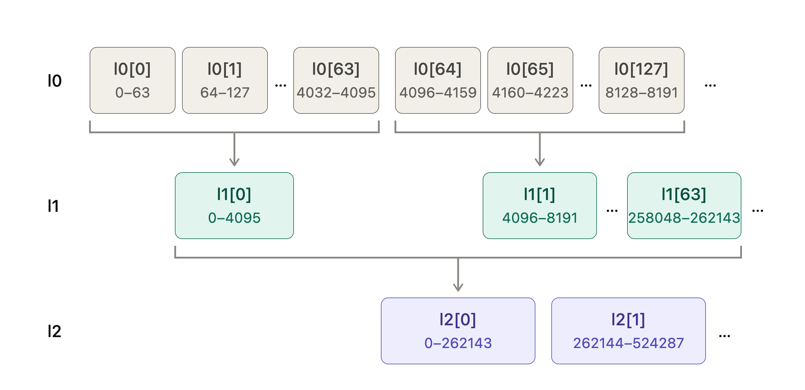

# BitMap 对整数快速索引用于 OrderBook 盘口维护

目标：嗅探脚本+Quoter程序(绑核+numa)

## BitMap 层级说明

`uint64_t L0`: 1 个 `uint64_t` 字中有 64 位(`bit`)，每个 `bit` 代表一个价格档位是否订单，即 `L0` 可以覆盖 64 个价格档位。

`vector<uint64_t> L1`: `L1[i]` 也有 64 位，每个 `bit` 代表所属的一个 `L0` 的价格档位是否有订单，即 `L1[i]` 可以覆盖 4096 个价格档位。

`vector<uint64_t> L2`: `L2[j]` 也有 64 位，每个 `bit` 代表所属的一个 `L1` 的价格档位是否有订单，即 `L2[j]` 可以覆盖 262144 个价格档位。

`vector<uint64_t> Ln`: `Ln[k]` 的每个 `bit` 代表所属的一个 `L(n-1)` 的价格档位是否有订单，即 `Ln[k]` 可以覆盖 $64^{n + 1}$ 个价格档位。

## 实际的价格档位应用

有效的价格档位一般: `0~1` 保留 4 位小数；`>1` 保留 2 位小数。

实际只需 `n = 2` 使用三层 BitMap 即可，`77` 个 `L2` 可以覆盖大约 `2kw` 个价格档位，即能覆盖 `0~20w` 的价格区间。剩余离散价格可以再用一个哈希表来单独存。

<div style='display: flex; justify-content: center;'>

</div>

## 示例代码
### BitMap.hpp

```cpp
#pragma once
#include <cmath>
#include <cstddef>
#include <cstdint>
#include <type_traits>
#include <unordered_map>
#include <vector>


// 无效档位索引 / 位图未找到。取 31 位全 1：比任何合法下标都大，又不占用最高位（最高位留给方向）
constexpr std::uint32_t kNone = 0x7FFFFFFFu;

// ============================================================================
// 三级位图：l0 每 bit 对应一个档位是否非空，l1 每 bit 标记 l0 的一个字是否非零，l2 同理标记 l1。
// 找最优价 / 相邻非空档只需在三层各做一次 clz 或 ctz，O(1)；置位清位同样 O(1)。l0 用外部提供的懒分配内存
// 下标换算：档位 i 在 l0 的第 i>>6 个字的第 i&63 位；l0 的第 w 个字在 l1 的第 w>>6 个字的第 w&63 位；l1 到 l2 同理。
// 所以档位 i 对应 l0[i>>6]、l1[i>>12]、l2[i>>18]
// ============================================================================
class Bitmap3 {
public:
    static std::size_t l0_words(std::uint32_t nbits) { return (nbits + 63) / 64; }   // 向上取整：nbits 个 bit 要几个 64 位字
    // l0 的内存由外面给（和档位数组同一块 mmap，懒分配）；l1、l2 很小（每边 39KB、616 字节），直接用 vector，构造时清零
    Bitmap3(std::uint32_t nbits, std::uint64_t* l0) : l0_(l0), n0_(l0_words(nbits)), l1_((n0_ + 63) / 64), l2_((l1_.size() + 63) / 64) {}
    // 置位：三层各置一位。不用判断上层原来是不是已经置过，重复置位没有副作用
    void set(std::uint32_t i) { l0_[i >> 6] |= bit(i); l1_[i >> 12] |= bit(i >> 6); l2_[i >> 18] |= bit(i >> 12); }
    void clear(std::uint32_t i) {   // 清位后所在字变 0 才需要向上层清
        if ((l0_[i >> 6] &= ~bit(i)) != 0) return;         // 清 l0 的这一位；这个字里还有别的位，上层不用动
        if ((l1_[i >> 12] &= ~bit(i >> 6)) != 0) return;   // l0 的这个字空了：清 l1 里代表它的那一位；l1 的这个字还有别的位就到此为止
        l2_[i >> 18] &= ~bit(i >> 12);                     // l1 的这个字也空了：清 l2 里代表它的那一位
    }
    bool test(std::uint32_t i) const { return l0_[i >> 6] & bit(i); }
    std::uint32_t prev_set(std::uint32_t i) const;   // 严格小于 i 的最高置位，无则 kNone（买方找下一档）
    std::uint32_t next_set(std::uint32_t i) const;   // 严格大于 i 的最低置位，无则 kNone（卖方找下一档）
    std::uint32_t highest() const;                   // 全图最高置位，无则 kNone
    std::uint32_t lowest() const;                    // 全图最低置位，无则 kNone
    std::uint64_t* l0() { return l0_; }

private:
    static std::uint64_t bit(std::uint32_t i) { return 1ull << (i & 63); }            // 字内第 i&63 位的掩码
    static std::uint32_t msb(std::uint64_t w) { return 63 - __builtin_clzll(w); }     // 最高置位的位置：clz 数前导零的个数。w 不能为 0
    static std::uint32_t lsb(std::uint64_t w) { return __builtin_ctzll(w); }          // 最低置位的位置：ctz 数末尾零的个数。w 不能为 0
    std::uint64_t* l0_; std::size_t n0_;   // l0 的起始地址和字数
    std::vector<std::uint64_t> l1_, l2_;
};
```

### BitMap.cpp

```cpp
#include "bitmap3.hpp"


// ============================================================================
// Bitmap3：每层先在当前字内找，找不到再上一层定位到相邻非零字，再逐层下来取最高/最低位
// ============================================================================
std::uint32_t Bitmap3::prev_set(std::uint32_t i) const {
    std::uint32_t w0 = i >> 6, w1 = i >> 12, w2 = i >> 18;   // 档位 i 所在的 l0 字、代表这个 l0 字的那一位所在的 l1 字、再往上的 l2 字
    // (1 << k) - 1 是低 k 位全 1 的掩码。k = i & 63 是 i 在字内的位置，所以这个掩码只留下比 i 低的位
    std::uint64_t m = l0_[w0] & ((1ull << (i & 63)) - 1);   // 本字内低于 i 的位
    if (m) return (w0 << 6) | msb(m);   // 本字内就有：取其中最高的一位。字下标 × 64 + 字内位置 = 档位下标
    // 本字内没有：到 l1 里找"下标比 w0 小的非空 l0 字"。w0 在它的 l1 字内的位置是 w0 & 63
    m = l1_[w1] & ((1ull << (w0 & 63)) - 1);                 // l1 中低于 w0 的非空字
    if (!m) {   // 这个 l1 字管的 64 个 l0 字里也没有：再上一层
        m = l2_[w2] & ((1ull << (w1 & 63)) - 1);             // l2 中低于 w1 的非空字，不足再向前扫 l2（最多几个字）
        while (!m) { if (w2 == 0) return kNone; m = l2_[--w2]; }   // 当前 l2 字里没有就逐个往前看；l2 一共只有 77 个字，扫到头还没有就是真的没有
        w1 = (w2 << 6) | msb(m); m = l1_[w1];   // 找到了最靠近的非空 l1 字：取它的下标，并拿出整个字（这时不用再加掩码，整个字都在 i 的下方）
    }
    w0 = (w1 << 6) | msb(m);             // l1 字里最高的一位 -> 最靠近的非空 l0 字的下标
    return (w0 << 6) | msb(l0_[w0]);     // 这个 l0 字里最高的一位 -> 档位下标
}

std::uint32_t Bitmap3::next_set(std::uint32_t i) const {   // 和 prev_set 完全对称：掩码换成"高于"，msb 换成 lsb，扫描方向换成向后
    std::uint32_t w0 = i >> 6, w1 = i >> 12, w2 = i >> 18;
    // 要的是"高于第 k 位的全部位"，本该是 ~0 << (k + 1)；但 k = 63 时要移 64 位，C++ 里移位数等于位宽是未定义行为，所以拆成先移 k 位、再移 1 位
    std::uint64_t m = l0_[w0] & (~0ull << (i & 63) << 1);   // 本字内高于 i 的位（两次移位避免移满 64 位）
    if (m) return (w0 << 6) | lsb(m);
    m = l1_[w1] & (~0ull << (w0 & 63) << 1);
    if (!m) {
        m = l2_[w2] & (~0ull << (w1 & 63) << 1);
        while (!m) { if (++w2 == l2_.size()) return kNone; m = l2_[w2]; }
        w1 = (w2 << 6) | lsb(m); m = l1_[w1];
    }
    w0 = (w1 << 6) | lsb(m);
    return (w0 << 6) | lsb(l0_[w0]);
}

std::uint32_t Bitmap3::highest() const {
    for (std::size_t w2 = l2_.size(); w2-- > 0;) if (l2_[w2]) {   // 从最后一个 l2 字往前找第一个非零的。w2-- > 0 先比较再减，循环体里的 w2 依次是 size-1 … 0
        std::uint32_t w1 = (w2 << 6) | msb(l2_[w2]), w0 = (w1 << 6) | msb(l1_[w1]);   // 逐层取最高位往下走
        return (w0 << 6) | msb(l0_[w0]);
    }
    return kNone;
}

std::uint32_t Bitmap3::lowest() const {
    for (std::size_t w2 = 0; w2 < l2_.size(); ++w2) if (l2_[w2]) {
        std::uint32_t w1 = (w2 << 6) | lsb(l2_[w2]), w0 = (w1 << 6) | lsb(l1_[w1]);
        return (w0 << 6) | lsb(l0_[w0]);
    }
    return kNone;
}
```