# 减脂 + 腹肌 健身计划

> 目标：体脂 21% → 15%（腹肌轮廓）→ 12%（清晰分块）。骨骼肌已超标，重点是保住肌肉、减掉躯干脂肪。
> 频率：每周 4–5 次（工作日隔天 + 周末两天），按 A → B → C → D 顺序循环，不绑定星期几。
> 每次时长控制在 60 分钟内。

---

## 通用原则

- 复合动作渐进负荷：规定次数上限都能完成 → 下次加重 2.5–5 kg
- 每组留 1–2 次余力，最后一组可做到力竭
- 组间休息：复合动作 90–120 秒，孤立动作 60 秒，腹部 30–45 秒
- 训练前 5 分钟动态热身 + 第一个复合动作做 2 组轻重量热身组
- 周末连练两天时排 A+B 或 C+D，避免连续两天练同一部位

---

## Day A · 推（胸 / 肩 / 三头 / 腹）

### 1. 杠铃卧推 4 × 6–8

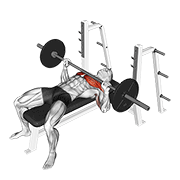

- 肩胛后缩下沉、夹紧，全程不松；脚踩实地面
- 握距略宽于肩，杠铃落到乳头下缘，小臂垂直地面
- 下放 2 秒控制，胸口轻触后推起，肘部不要完全锁死
- 常见错误：臀部离开凳子、肘部外展 90° 压肩

### 2. 俯卧撑 3 × 力竭（或上斜哑铃卧推 3 × 10）

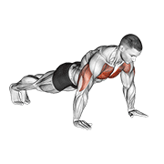

- 手比肩略宽，身体从头到脚一条直线，核心收紧
- 胸口降到离地一拳，肘部与躯干约 45°
- 能做 25+ 就换上斜哑铃卧推，或脚垫高

### 3. 蝴蝶机夹胸 3 × 12–15

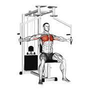

- 座位调到握把与胸口同高，肘微屈固定不变
- 用胸把手臂"夹"到一起，顶峰停 1 秒挤压
- 回程慢放，不要让配重片砸到底

### 4. 哑铃侧平举 4 × 12–15

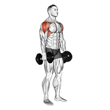

- 肘微屈，肘领先于手腕向上，举到与肩平即可
- 顶端手略低于肘（像倒水），避免斜方肌代偿
- 重量宁轻勿重，不要借力甩

### 5. 绳索下压（三头）3 × 12

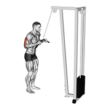

- 上臂贴紧躯干，只动肘关节
- 底部完全伸直并挤压三头 1 秒
- 回程小臂不超过水平线，保持张力

### 6. 腹部：卷腹 3 × 15 + 平板支撑 3 × 45 秒

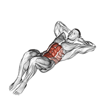

- 卷腹：下背贴地，靠腹肌把肩胛"卷"离地面，不是用脖子往上够
- 顶端呼气并停 1 秒，回程不完全躺平

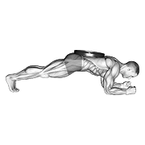

- 平板：肘在肩正下方，臀部微收（骨盆后倾），身体一条直线
- 臀部塌下或撅起都是核心松了，宁可缩短时间也要保持姿势
- 图示为背上负重版本，徒手做即可；45 秒轻松完成再考虑加片

---

## Day B · 腿臀

### 1. 杠铃深蹲 4 × 6–8

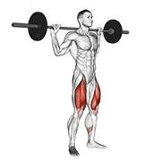

- 杠铃放上斜方肌，双手尽量窄握夹紧背部
- 吸气、腹压顶住腰带的感觉，再下蹲；膝盖朝脚尖方向打开
- 蹲到大腿至少平行地面，全脚掌发力站起
- 常见错误：膝盖内扣、腰部反弓过度、脚跟离地

### 2. 罗马尼亚硬拉 3 × 8–10

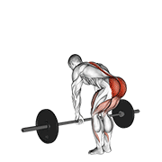

- 膝盖微屈固定，屈髋把臀部往后推，杠铃贴着大腿下滑
- 下到腘绳肌明显拉伸（约小腿中段）即可，背部全程中立
- 站起时臀部向前顶、夹紧，不要靠腰往后仰
- 参考：传统硬拉（膝盖屈得更多、杠从地面起）

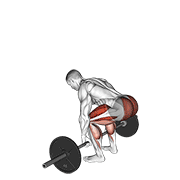

### 3. 臀推 3 × 10–12

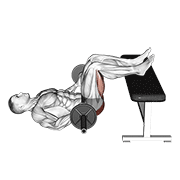

- 上背靠凳沿，脚踩在顶峰时小腿垂直地面的位置
- 下巴微收看向前方，顶峰臀部完全伸展并夹紧 1–2 秒
- 下放时控制，不要靠腰反弓完成动作

### 4. 腿举 或 保加利亚分腿蹲 3 × 10（可选）

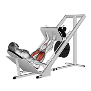

- 腿举：脚放中上位置，下到膝盖约 90°，膝盖不要锁死
- 分腿蹲：前脚全脚掌承重，躯干略前倾，后脚只做支撑

### 5. 有氧 15 分钟

- 跑步机坡度 8–12% 快走，或单车中等强度，心率 130–150

---

## Day C · 拉（背 / 二头 / 后肩 / 腹）

### 1. 引体向上 4 × 力竭

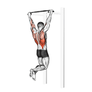

- 正握略宽于肩，起始完全悬垂，先下沉肩胛再拉
- 想象"把肘拉向口袋"，胸口去够杠
- 能做 10+ 就负重；不足 6 个用助力带或弹力带
- 常见错误：借力摆荡、只做半程

### 2. 高位下拉 3 × 10

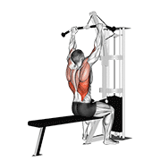

- 大腿固定好，躯干略后仰 10–15°
- 拉到锁骨位置，肘向下向后，顶点挤压背阔肌
- 回程慢放让背阔肌充分拉长，不要耸肩

### 3. 坐姿划船 3 × 10–12

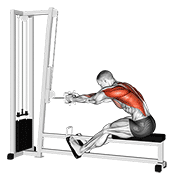

- 躯干固定直立，不要前后摇摆借力
- 肘贴身向后拉，把手拉到腹部，肩胛夹紧
- 回程时肩胛主动前伸，让背部拉开

### 4. 面拉 3 × 15

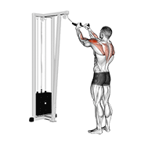

- 绳索调到面部高度，肘高于手腕
- 拉向面部时双手向两侧分开，肘向后向外
- 顶点感受后肩和中背收紧，重量要轻

### 5. 哑铃弯举 3 × 12

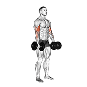

- 肘固定在身体两侧，只动小臂
- 顶端挤压二头 1 秒，下放 2–3 秒
- 不要用肩或腰摆动借力

### 6. 腹部：悬垂举腿 3 × 10–12 + 绳索卷腹 3 × 15

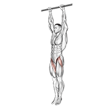

- 悬垂举腿：身体不摆动，靠腹肌把骨盆卷起（不只是抬腿）
- 做不了直腿就做屈膝版本

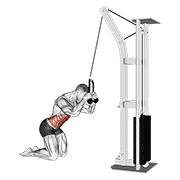

- 绳索卷腹：跪姿，绳索固定在头两侧，髋不动
- 用腹肌把上身"卷"向大腿，肘去够膝盖

---

## Day D · 有氧 + 腹 + 弱项

### 1. 有氧 30 分钟

- 跑步机 / 单车 / 椭圆机，心率 130–150，能说话但不能唱歌的强度

### 2. 腹部循环 3 轮

- 仰卧卷腹 × 15
- 俄罗斯转体 × 20（左右各算 1）
- 平板支撑 60 秒
- 轮间休息 60 秒

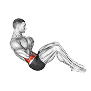

- 转体：上身后仰约 45°，转的是躯干不是手臂，双脚可离地增加难度

### 3. 弱项补练 3 组

- 自选一个感觉最弱的动作（侧平举、臀推、面拉等），3 × 12–15

---

## 每 4–6 周复测

- 体脂率是否在降（目标每周 -0.3～0.5%）
- 骨骼肌是否守住（≥ 32 kg）
- 躯干脂肪 8.2 kg 是否在减少
- 复合动作重量是否在涨

---

## 背景数据（2026-09）

| 指标 | 数值 | 说明 |
|---|---|---|
| 身高 / 体重 | 175 cm / 72.1 kg | BMI 23.5 |
| 骨骼肌 | 32.2 kg | 超标准 |
| 体脂 | 15.3 kg / 21.2% | 目标 15% → 12% |
| 躯干脂肪 | 8.2 kg | 标准的 135.7%，四肢脂肪均低于标准 |

典型的四肢瘦、肚子有脂肪。肌肉底子够，重点是保住肌肉、减躯干脂肪。

## 附：动图来源

动作 GIF 来自 [hasaneyldrm/exercises-dataset](https://github.com/hasaneyldrm/exercises-dataset)，媒体版权 © Gym visual — https://gymvisual.com/ ，按其许可以 180×180 分辨率使用。
